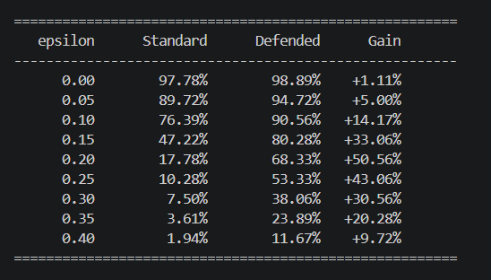

# FGSM Adversarial Attack & Defense on MNIST

## Overview
This project demonstrates how a trained CNN can be fooled by the **Fast Gradient Sign Method (FGSM)** attack and how **Adversarial Training** can improve robustness.

## Project Structure
```
FGSM_Project/
├── dataset/              ← digit dataset (.npz)
├── models/               ← saved Keras models (.h5)
│   ├── cnn_model.h5
│   └── defended_cnn.h5
├── attacks/
│   └── fgsm.py           ← FGSM attack implementation
├── defenses/
│   └── adversarial_training.py  ← defense via augmented retraining
├── notebooks/
│   └── experiment.ipynb  ← interactive walkthrough
├── results/
│   ├── graphs/           ← accuracy curves, comparison plots
│   └── images/           ← adversarial sample visualisations
└── main.py               ← full end-to-end pipeline
```


## Methodology

Load Data → Train CNN → FGSM Attack → Adversarial Training → Compare Results

A standard CNN is trained on digit images, attacked using FGSM at increasing strengths, then a second copy of the model is retrained with adversarial examples mixed into every epoch to build robustness. Both models are then attacked under identical conditions and compared.


## Quick Start
```bash
pip install tensorflow numpy matplotlib scikit-learn jupyter

# Run the full pipeline
python main.py

# Or open the notebook
jupyter notebook notebooks/experiment.ipynb
```

## How FGSM Works
```
x_adv = x + ε · sign(∇_x J(θ, x, y))
```
A single gradient step in the direction that maximises the loss produces an image that looks identical to humans but fools the model.

## Results Summary



The defended model outperforms the standard model at **every** epsilon value, with the largest gain (+50.56%) at ε=0.20 — exactly where the standard model has already collapsed but the defended model is still holding together.

## Dataset

Uses scikit-learn's `load_digits()` (1,797 handwritten digit samples, originally 8×8 pixels, upscaled to 28×28 to match standard CNN input size). Used as a lightweight, dependency-free substitute for MNIST.

## Defense: Adversarial Training
Each mini-batch is augmented with its FGSM counterpart at ε=0.15 before the gradient update. This exposes the model to adversarial inputs during training, building immunity.

## References
- Goodfellow et al. (2014) — *Explaining and Harnessing Adversarial Examples*
- Madry et al. (2018) — *Towards Deep Learning Models Resistant to Adversarial Attacks*
